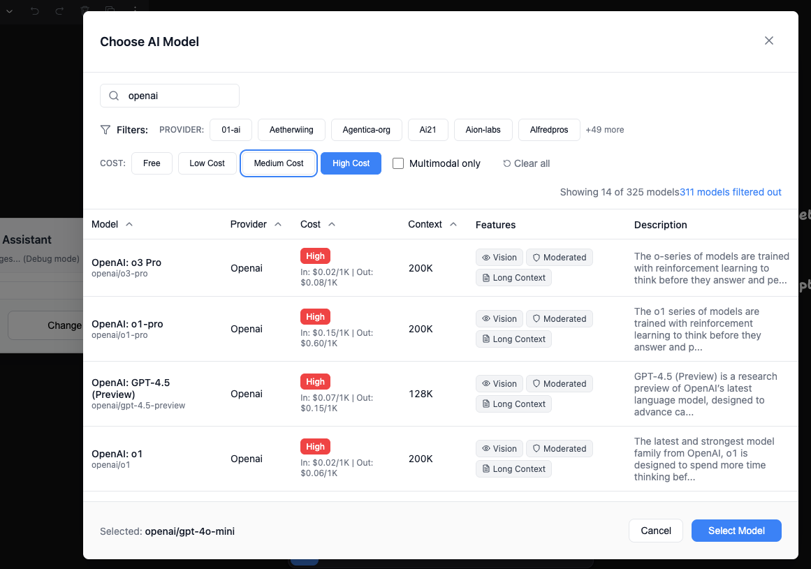

# OpenRouter Model Picker

A React component that gives you an **in-app model selector** for the [OpenRouter API](https://openrouter.ai/docs/api-reference/list-available-models). Browse, filter, and select from 325+ AI models with real-time cost comparison and spec viewing - no more alt-tabbing during development.

*This is an unofficial tool created by a user of OpenRouter's service - not affiliated with or endorsed by OpenRouter.*


[](https://badge.fury.io/js/openrouter-model-picker)
[](https://www.npmjs.com/package/openrouter-model-picker)



## 🎯 Why This Exists

**LLM model selection is a moving target.** When building AI-powered applications, choosing the right model involves constant trade-offs between cost, quality, speed, and capabilities. This is what I call finding **Product-Model Fit** - the model that best serves your product at each stage of development.

> 📖 **Read more:** [Product Model Fit with OpenRouter Model Picker](https://dannyshmueli.com/2025/06/21/Product-Model-Fit-with-OpenRouter-Model-Picker/) - A deeper dive into the concept and development story behind this component.

As a developer, I found myself constantly alt-tabbing between the OpenRouter website and my code to explore available models, compare pricing, and check capabilities. This became especially tedious when:

- **Building prototypes** where I needed to quickly test different models
- **Optimizing costs** by comparing pricing across providers and model tiers  
- **Matching capabilities** to specific use cases (vision, context length, etc.)
- **Avoiding analysis paralysis** with 325+ model options

Rather than hardcoding a few model options or losing momentum switching between tabs, this component brings the entire OpenRouter model catalog directly into your application. Make informed decisions about model selection based on real-time pricing, capabilities, and performance characteristics - all within your app's interface.

**Perfect for:**
- Finding **Product-Model Fit** during development and iteration
- Developer tools and AI playgrounds  
- Cost optimization dashboards
- Multi-model AI applications
- Educational tools teaching about different LLMs

## ✨ Features

- 🔍 **Smart Filtering**: Real-time search across model names, providers, descriptions, and features
- 🧠 **Reasoning Models**: Built-in detection and filtering for reasoning/thinking models (o1, DeepSeek R1, etc.)
- 📋 **API Examples Modal**: Copy-paste ready code examples with comprehensive reasoning token configuration
- ⏹️ **Stream Cancellation**: Detection and filtering for models supporting cost-control stream cancellation
- 💰 **Cost Awareness**: Color-coded pricing tiers and detailed cost breakdowns
- 📊 **Performance Metrics**: Context window and capability information
- ♿ **Accessibility**: Full keyboard navigation, screen reader support, ARIA compliance
- 📱 **Responsive**: Optimized for desktop, tablet, and mobile devices
- 🎨 **Customizable**: Light/dark themes, custom sizing, and CSS classes
- ⚡ **Performance**: Debounced search, memoized operations, efficient rendering
- 🔒 **Type Safe**: Full TypeScript support with comprehensive type definitions

## 🚀 Installation

```bash
npm install openrouter-model-picker
# or
yarn add openrouter-model-picker
# or
pnpm add openrouter-model-picker
```

> 💡 **Want to try the demo first?** See the [Try the Demo](#-try-the-demo) section below for instructions on running the interactive demo.

### Installing from GitHub (Development)

```bash
npm install github:dannyshmueli/openrouter-model-picker
```

## 📦 Basic Usage

```tsx
import React, { useState } from 'react'
import { ModelChooserModal } from 'openrouter-model-picker'
import 'openrouter-model-picker/styles'

function App() {
  const [selectedModel, setSelectedModel] = useState('openai/gpt-4o-mini')
  const [isModalOpen, setIsModalOpen] = useState(false)

  return (
    <>
      <button onClick={() => setIsModalOpen(true)}>
        Choose Model: {selectedModel}
      </button>

      <ModelChooserModal
        isOpen={isModalOpen}
        onClose={() => setIsModalOpen(false)}
        selectedModel={selectedModel}
        onModelChange={setSelectedModel}
      />
      
      {/* 
        💡 After selecting a model, use the "View API Examples" button 
        in the component for copy-paste ready code examples!
      */}
    </>
  )
}
```

## 🧠 Enhanced API with Reasoning Detection

```tsx
import React, { useState } from 'react'
import { ModelChooserModal, ModelInfo } from 'openrouter-model-picker'
import 'openrouter-model-picker/styles'

function AdvancedApp() {
  const [selectedModel, setSelectedModel] = useState('openai/gpt-4o-mini')
  const [selectedModelInfo, setSelectedModelInfo] = useState<ModelInfo | null>(null)
  const [isModalOpen, setIsModalOpen] = useState(false)

  const handleApiCall = async () => {
    if (!selectedModel || !selectedModelInfo) return
    
    try {
      const response = await fetch('https://openrouter.ai/api/v1/chat/completions', {
        method: 'POST',
        headers: {
          'Authorization': `Bearer ${process.env.OPENROUTER_API_KEY}`,
          'Content-Type': 'application/json'
        },
        body: JSON.stringify({
          model: selectedModel,
          messages: [{ role: 'user', content: 'Hello, how are you?' }],
          // 🧠 Automatically enable streaming for reasoning models!
          stream: selectedModelInfo.reasoning || false
        })
      })
      
      console.log('Model supports reasoning:', selectedModelInfo.reasoning)
    } catch (error) {
      console.error('API Error:', error)
    }
  }

  return (
    <>
      <button onClick={() => setIsModalOpen(true)}>
        Choose Model: {selectedModel}
        {selectedModelInfo?.reasoning && ' 🧠'}
      </button>

      <ModelChooserModal
        isOpen={isModalOpen}
        onClose={() => setIsModalOpen(false)}
        selectedModel={selectedModel}
        onModelChange={setSelectedModel}
        onModelSelect={setSelectedModelInfo}  // Enhanced callback with full model info
      />
      
      {/* 
        🚀 Pro tip: Click "View API Examples" in the modal for comprehensive
        reasoning token configuration examples with copy-paste functionality!
      */}
    </>
  )
}
```

## 📋 API Examples Modal

The component includes a comprehensive API examples modal that provides copy-paste ready code examples for all OpenRouter use cases, including complete reasoning token configuration.

### Features
- **📝 Basic Tab**: Standard API call examples
- **🧠 Reasoning Tab**: Complete reasoning token examples with all parameters
- **🌊 Streaming Tab**: Streaming configuration with cancellation support
- **📋 Copy-to-Clipboard**: One-click copying of any example
- **📱 Responsive Design**: Full-screen modal with proper scrolling
- **🔗 Documentation Links**: Direct links to OpenRouter docs

### Access the Modal
When you select a model in the picker, use the **"View API Examples"** button to open the comprehensive examples modal.

### Reasoning Token Examples

The modal provides four complete reasoning configuration examples:

#### 1. Effort-Based Configuration (OpenAI o-series, Grok)
```json
{
  "model": "openai/o1-preview",
  "messages": [{ "role": "user", "content": "What's bigger, 9.9 or 9.11?" }],
  "stream": true,
  "reasoning": {
    "effort": "high",        // "high", "medium", or "low"
    "exclude": false,        // Include reasoning in response
    "enabled": true          // Explicitly enable reasoning
  }
}
```

#### 2. Token-Based Configuration (Anthropic, Gemini)
```json
{
  "model": "anthropic/claude-3.5-sonnet:thinking",
  "messages": [{ "role": "user", "content": "Solve this step by step..." }],
  "stream": true,
  "reasoning": {
    "max_tokens": 2000,      // Specific token limit
    "exclude": false,        // Include reasoning in response
    "enabled": true          // Explicitly enable reasoning
  }
}
```

#### 3. Hidden Reasoning (Internal Use Only)
```json
{
  "reasoning": {
    "effort": "medium",      // Use reasoning internally
    "exclude": true,         // Hide reasoning from response
    "enabled": true          // Enable reasoning processing
  }
}
```

#### 4. Complete Configuration (All Parameters)
```json
{
  "reasoning": {
    "max_tokens": 1500,      // Anthropic-style token limit
    "exclude": false,        // Include reasoning in response
    "enabled": true          // Explicitly enable reasoning
  }
}
```

### Configuration Guidelines
- **Effort vs Max Tokens**: Use one or the other, not both
- **effort**: "high"/"medium"/"low" (OpenAI o-series, Grok)
- **max_tokens**: Specific token limit (Anthropic, Gemini thinking)
- **exclude**: false (default) = show reasoning, true = hide it
- **enabled**: Auto-inferred from effort/max_tokens, can override
- **Billing**: Reasoning tokens are charged as output tokens
- **Streaming**: Use stream: true to see thinking process live

## 🔧 Advanced Usage

### Using the Selected Model

```tsx
import React, { useState } from 'react'
import { ModelChooserModal } from 'openrouter-model-picker'
import 'openrouter-model-picker/styles'

function AdvancedApp() {
  const [selectedModel, setSelectedModel] = useState('openai/gpt-4o-mini')
  const [isModalOpen, setIsModalOpen] = useState(false)

  const handleApiCall = async () => {
    if (!selectedModel) return
    
    try {
      const response = await fetch('https://openrouter.ai/api/v1/chat/completions', {
        method: 'POST',
        headers: {
          'Authorization': `Bearer ${process.env.OPENROUTER_API_KEY}`,
          'Content-Type': 'application/json'
        },
        body: JSON.stringify({
          model: selectedModel, // Use the selected model ID
          messages: [
            { role: 'user', content: 'Hello, how are you?' }
          ]
        })
      })
      
      const data = await response.json()
      console.log('Response:', data)
    } catch (error) {
      console.error('API Error:', error)
    }
  }

  return (
    <div>
      <button onClick={() => setIsModalOpen(true)}>
        Choose Model
      </button>
      
      {selectedModel && (
        <div>
          <p>Selected: {selectedModel}</p>
          <button onClick={handleApiCall}>
            Make API Call
          </button>
        </div>
      )}

      <ModelChooserModal
        isOpen={isModalOpen}
        onClose={() => setIsModalOpen(false)}
        selectedModel={selectedModel}
        onModelChange={setSelectedModel}
        maxHeight="90vh"          // Custom height
        maxWidth="1200px"         // Custom width
        className="my-modal"      // Custom CSS class
      />
    </div>
  )
}
```

### With Custom Fallback Data

```tsx
import { ModelChooserModal, ModelInfo } from 'openrouter-model-picker'
import 'openrouter-model-picker/styles'

const fallbackModels: ModelInfo[] = [
  {
    id: 'openai/gpt-4o-mini',
    name: 'GPT-4o Mini',
    provider: 'OpenAI',
    costTier: 'low',
    description: 'Fast and affordable multimodal model',
    features: ['Vision', 'Fast'],
    pricing: { input: 0.00015, output: 0.0006, currency: 'USD' },
    context: 128000,
    multimodal: true
  }
]

function AppWithFallback() {
  return (
    <ModelChooserModal
      // ... other props
      fallbackModels={fallbackModels}
    />
  )
}
```

## 📋 API Reference

### ModelChooserModalProps

| Prop | Type | Default | Description |
|------|------|---------|-------------|
| `isOpen` | `boolean` | - | Controls modal visibility |
| `onClose` | `() => void` | - | Called when modal is closed |
| `selectedModel` | `string` | - | Currently selected model ID |
| `onModelChange` | `(modelId: string) => void` | - | Called when model selection changes |
| `onModelSelect` | `(model: ModelInfo) => void` | - | Enhanced callback with full model info (including reasoning capability) |
| `fallbackModels` | `ModelInfo[]` | - | Fallback model data |
| `maxHeight` | `string` | `'80vh'` | Maximum modal height |
| `maxWidth` | `string` | - | Maximum modal width |
| `className` | `string` | - | Custom CSS class |

### ModelInfo Interface

```typescript
interface ModelInfo {
  id: string                    // Model ID (e.g., "openai/gpt-4o")
  name: string                  // Display name
  provider: string              // Provider name
  costTier: 'free' | 'low' | 'medium' | 'high'
  description: string           // Model description
  features?: string[]           // Capability tags
  pricing?: {
    input: number              // Input token price
    output: number             // Output token price
    currency: string           // Currency code
  }
  context?: number             // Context window size
  multimodal?: boolean         // Supports images/files
  reasoning?: boolean          // Supports reasoning/thinking tokens
  streamCancel?: boolean       // Supports stream cancellation for cost control
}
```

## 🧠 Reasoning Models Support

The component automatically detects and highlights models that support reasoning/thinking tokens based on OpenRouter's official documentation:

### Detection Method
- **Conservative Pattern Matching**: Uses specific patterns for officially supported reasoning models
- **Note**: The OpenRouter API's `internal_reasoning` field indicates **pricing per reasoning token**, not reasoning capability

### Officially Supported Reasoning Models
- **OpenAI o-series**: o1, o1-preview, o1-mini *(don't return reasoning tokens)*
- **DeepSeek R1**: All R1 variants and derived models
- **Gemini Thinking**: Gemini thinking models
- **Anthropic**: Claude thinking variants  
- **Grok**: Grok reasoning models
- **Others**: MiniMax M1, Qwen R1, and explicit reasoning/thinking models

### Visual Indicators
- **🧠 Reasoning badge** in the Features column and selected model display
- **"Reasoning only" filter** to show only models with thinking capabilities
- **Brain icon** 🧠 next to reasoning features in the model table

### ⚠️ Important Limitations
- **Pattern-Based Detection**: Reasoning capabilities are detected using hardcoded patterns for known models, not an official API field
- **May Miss New Models**: Newly released reasoning models may not be detected until patterns are updated
- **No Official API Support**: OpenRouter doesn't provide a `supports_reasoning` field, so detection relies on model name patterns
- **Subject to Change**: Detection patterns may need updates as new reasoning models are released

### Technical Notes
- Some reasoning models (like OpenAI o-series) use reasoning internally but don't return reasoning tokens in API responses
- Reasoning tokens appear in the `reasoning` field when using `include_reasoning: true` in API calls
- Reasoning tokens are charged as output tokens

When you select a reasoning model, you'll see clear indicators that it supports step-by-step thinking capabilities, helping you make informed decisions about which models to use for complex reasoning tasks.

### 📋 API Examples for Reasoning Models
For reasoning models, click the **"🧠 View API Examples"** button to access comprehensive, copy-paste ready code examples including:
- Complete reasoning token configuration with all parameters (`effort`, `max_tokens`, `exclude`, `enabled`)
- Provider-specific examples (OpenAI o-series vs Anthropic thinking models)
- Hidden reasoning configuration for internal use
- Streaming setup for real-time thinking process visualization

The examples modal provides production-ready code that you can immediately use with the OpenRouter API.

### 🔄 Automatic Streaming for Reasoning Models

Use the enhanced `onModelSelect` callback to automatically enable streaming for reasoning models:

```tsx
const handleModelSelect = (model: ModelInfo) => {
  setSelectedModel(model.id)
  
  // Your OpenRouter API call
  const apiCall = {
    model: model.id,
    messages: [...],
    stream: model.reasoning || false  // Auto-enable streaming for reasoning models
  }
  
  console.log(`Streaming ${model.reasoning ? 'enabled' : 'disabled'} for ${model.name}`)
}

<ModelChooserModal
  onModelSelect={handleModelSelect}
  // ... other props
/>
```

This ensures optimal user experience since reasoning models work best with streaming to show the thinking process in real-time.

## ⏹️ Stream Cancellation Support

The component automatically detects and highlights models that support stream cancellation - the ability to immediately stop model processing and billing when you abort a streaming request.

### Detection Method
- **Provider-Based Detection**: Uses the official provider list from OpenRouter documentation
- **Critical for Cost Control**: Stream cancellation prevents unwanted charges when you need to stop a request mid-stream

### Visual Indicators  
- **⏹️ Stream Cancel badge** in the Features column and selected model display
- **"Stream cancel only" filter** to show only models with this capability
- **Stop icon** ⏹️ next to stream cancellation features in the model table

### Supported Providers
**✅ Stream Cancellation Supported:**
- OpenAI, Azure, Anthropic
- Fireworks, Mancer, Recursal
- AnyScale, Lepton, OctoAI  
- Novita, DeepInfra, Together
- Cohere, Hyperbolic, Infermatic
- Avian, XAI, Cloudflare
- SFCompute, Nineteen, Liquid
- Friendli, Chutes, DeepSeek

**❌ Stream Cancellation NOT Supported:**
- AWS Bedrock, Groq, Modal
- Google, Google AI Studio, Minimax
- HuggingFace, Replicate, Perplexity
- Mistral, AI21, Featherless
- And others...

### Important Note
Without stream cancellation support, you'll be charged for the complete response even if you abort the request. This makes stream cancellation crucial for cost control in production applications.

When you select a model with stream cancellation support, you'll see the ⏹️ badge indicating that you can safely abort streaming requests without incurring unnecessary costs.

## 🎨 Theming and Customization

### CSS Custom Properties

```css
.openrouter-modal {
  --or-primary-color: #3b82f6;
  --or-primary-hover: #2563eb;
  --or-background: #ffffff;
  --or-text: #111827;
  --or-text-secondary: #6b7280;
  --or-border: #e5e7eb;
}

/* Dark theme */
.openrouter-modal.dark {
  --or-background: #1f2937;
  --or-text: #f9fafb;
  --or-text-secondary: #9ca3af;
  --or-border: #374151;
}
```

### Cost Tier Colors

- **Free**: `#10b981` (green)
- **Low**: `#3b82f6` (blue)
- **Medium**: `#f59e0b` (amber)
- **High**: `#ef4444` (red)

## 🔌 Hooks and Utilities

### useModelData Hook

```tsx
import { useModelData } from 'openrouter-model-picker'

function CustomComponent() {
  const { models, loading, error, refresh } = useModelData()
  
  // Use models data directly
  return (
    <div>
      {models.map(model => (
        <div key={model.id}>{model.name}</div>
      ))}
    </div>
  )
}
```

### useFiltering Hook

```tsx
import { useFiltering } from 'openrouter-model-picker'

function FilteredList({ models }) {
  const {
    filteredModels,
    filterState,
    updateFilter,
    clearFilters
  } = useFiltering(models)

  return (
    <div>
      <input
        type="text"
        onChange={(e) => updateFilter('searchTerm', e.target.value)}
        placeholder="Search models..."
      />
      {/* Render filtered models */}
    </div>
  )
}
```

## ♿ Accessibility

The component is built with accessibility in mind:

- **Keyboard Navigation**: Full support for keyboard-only users
- **Screen Readers**: ARIA labels and semantic HTML structure
- **Focus Management**: Proper focus trapping within the modal
- **High Contrast**: Support for high contrast mode
- **Reduced Motion**: Respects `prefers-reduced-motion` setting

## 📱 Responsive Design

### Breakpoints

- **Mobile**: `< 768px` - Simplified layout, touch-optimized
- **Tablet**: `768px - 1024px` - Condensed columns
- **Desktop**: `> 1024px` - Full table layout

### Mobile Adaptations

- Card-based layout instead of table
- Touch-friendly filter controls
- Optimized modal sizing

## 🔒 Error Handling

The component gracefully handles various error scenarios:

- **API Unavailable**: Falls back to cached or provided fallback data
- **Network Errors**: Shows retry option with error details
- **Rate Limiting**: Displays appropriate messages with retry timers
- **Empty Results**: Clear messaging with filter reset options

## 📊 Performance

### Optimization Features

- **Debounced Search**: 300ms delay to reduce excessive filtering
- **Memoized Operations**: Optimized filtering and sorting
- **Efficient Rendering**: Optimized React components
- **Small Bundle Size**: 44.3 kB package size

## 🎮 Try the Demo

Want to try the interactive demo before integrating? The demo showcases all features including the comprehensive API examples modal.

### 🌐 Live Interactive Demo
Visit the full demo: **[https://dannyshmueli.github.io/openrouter-model-picker/](https://dannyshmueli.github.io/openrouter-model-picker/)**

### 🚀 Run Demo Locally

```bash
# Clone the repository
git clone https://github.com/dannyshmueli/openrouter-model-picker
cd openrouter-model-picker

# Install dependencies
npm install

# Option 1: Development server (hot reload)
npm run dev

# Option 2: Build and preview (production-like)
npm run build-demo
npm run preview-demo
```

This will start the development server at `http://localhost:5173` where you can:
- 🔍 Test all filtering options
- 🧠 Explore reasoning model detection
- 📋 Try the API examples modal with copy-paste functionality
- ⏹️ See stream cancellation indicators
- 🎨 Experience the full responsive design

## 🛠️ Development

### Setup

```bash
git clone https://github.com/dannyshmueli/openrouter-model-picker
cd openrouter-model-picker
npm install
```

### Development Server

```bash
npm run dev
```

### Build

```bash
npm run build
```

### Type Check

```bash
npm run type-check
```

## 📄 License

MIT License - see [LICENSE](LICENSE) file for details.

## 🤝 Contributing

Contributions are welcome! Please feel free to submit a Pull Request.

## 📞 Support

- 📖 [GitHub Repository](https://github.com/dannyshmueli/openrouter-model-picker)
- 🐛 [Issue Tracker](https://github.com/dannyshmueli/openrouter-model-picker/issues)
- 📦 [npm Package](https://www.npmjs.com/package/openrouter-model-picker)

## 🙏 Acknowledgments

- [OpenRouter](https://openrouter.ai) for the AI model API
- [Lucide React](https://lucide.dev) for the icon set
- The React community for best practices and patterns

---

Built with ❤️ for the AI and Vibe coding community 